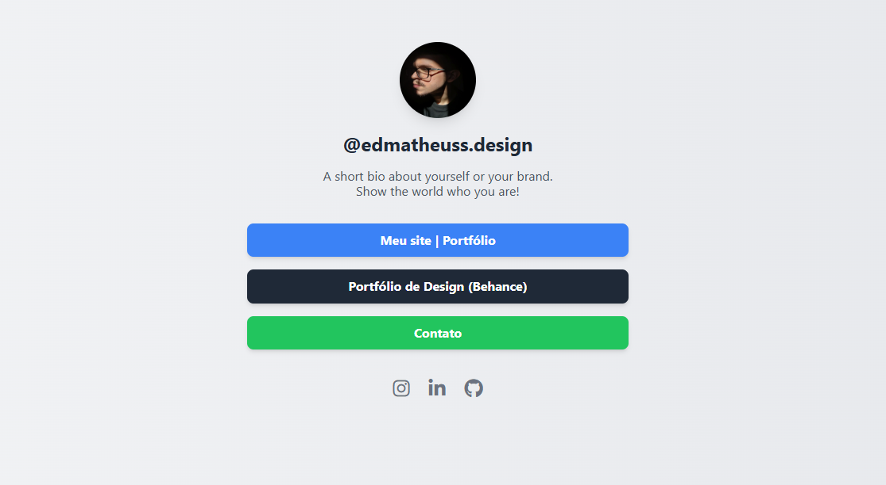

# Pro-Links

Um modelo de página "link na bio" simples, limpo e totalmente responsivo, criado como uma alternativa de código aberto a serviços como o Linktree. Este projeto foi desenvolvido com HTML puro e Tailwind CSS via CDN, com foco em simplicidade, desempenho e fácil personalização.

---

## 🚀 Live Demo

Você pode conferir a versão ao vivo hospedada na Vercel aqui:

**[https://pro-links-gamma.vercel.app/](https://pro-links-gamma.vercel.app/)**



---

## ✨ Features

* **Design limpo e minimalista:** Um visual profissional para representar sua marca.
* **100% responsivo:** Fica ótimo em qualquer dispositivo, de celulares a desktops.
* **Fácil de Customizar:** Não é necessário nenhum processo complexo de construção. Edite um único arquivo HTML para começar.
* **Leve e Rápido:** Desenvolvido para desempenho sem inchaço desnecessário.

---

## 🔧 Tech Stack

* **HTML5**
* **Tailwind CSS** (via CDN pela simplicidade)
* **Font Awesome** (para os ícones de redes sociais)
* **Vercel** (para hospedagem)

---

## ⚙️ How to Use & Customize

Para usar este modelo para sua própria página "link na bio", siga estas etapas:

1.  **Faça um fork ou clone esse repositório.**
2.  **Abra o arquivo `index.html`** em um editor de código de sua escolha.
3.  **Personalize seu conteúdo** como descrito abaixo.

---

### Personalizando sua Página

#### 1. Imagem de Perfil
Para mudar a imagem de perfil, encontre a tag `` e mude o atributo `src`  colocando um link direto de sua imagem. Você pode "hospedar" sua imagem em serviços como o [Imgur](https://imgur.com/), ou colocar ela dentro da pasta `images`, encontrada dentro da pasta `assets`.

```html

```

---

#### 2. Nome e Bio
Localize e edite as tags `<h1>` e `<p>` com seu nome de usuário e biografia.

```html
<h1 class="text-2xl font-bold text-gray-800">@seu_nomedeusuario</h1>
<p class="text-gray-600 mt-2">Uma pequena bio sobre você...</p>
```

---

#### 3. Links
Para cada link/botão, edite o atributo `href` com sua URL de destino e mude o texto do botão.

```html
<a href="[https://yourwebsite.com](https://yourwebsite.com)" target="_blank" class="...">
    Meu Site
</a>
```

---

#### 4. Ícones Sociais
De modo similar, edite o atributo `href` para cada ícone de rede social para apontar para seus perfis.

```html
<a href="[https://instagram.com/yourprofile](https://instagram.com/yourprofile)" target="_blank" ...><i class="fab fa-instagram"></i></a>
```

---

#### 5. Cores
As cores são definidas com classes do Tailwind CSS. Por exemplo, para mudar a cor de fundo de um botão de azul para roxo, simplesmente mude a classe `bg-blue-500` para `bg-purple-500`. Você pode encontrar todas as opções de cores na [documentação oficial do Tailwind CSS](https://tailwindcss.com/docs/colors).

---

Criado por **Edson Matheus**.